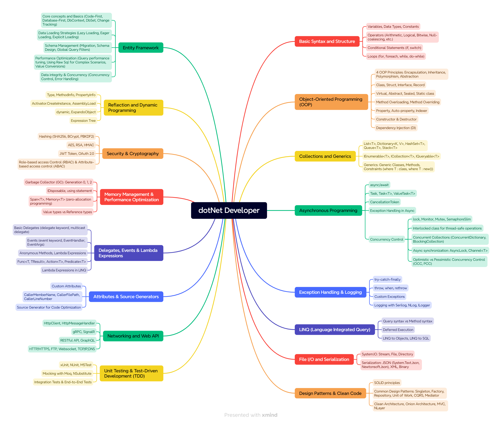

# .NET Developer Roadmap

[Basic Syntax & Structure](basic-syntax-and-structure/README.md)

[Object-Oriented Programming (OOP)]
[Collections & Generics]

[Asynchronous Programming]

[Exception Handling & Logging]

[Language Integrated Query (LINQ)]

[File I/O & Serialization]

[Entity Framework]

[Refection & Dynamic Programming]

[Security & Crytography]

[Memory Management & Performance Optimization]

[Delegates, Events & Lambda Expressions]

[Networking & WebAPI]

[UnitTesting & Test-Drivent Development]

[Design Pattern & Clean Code]