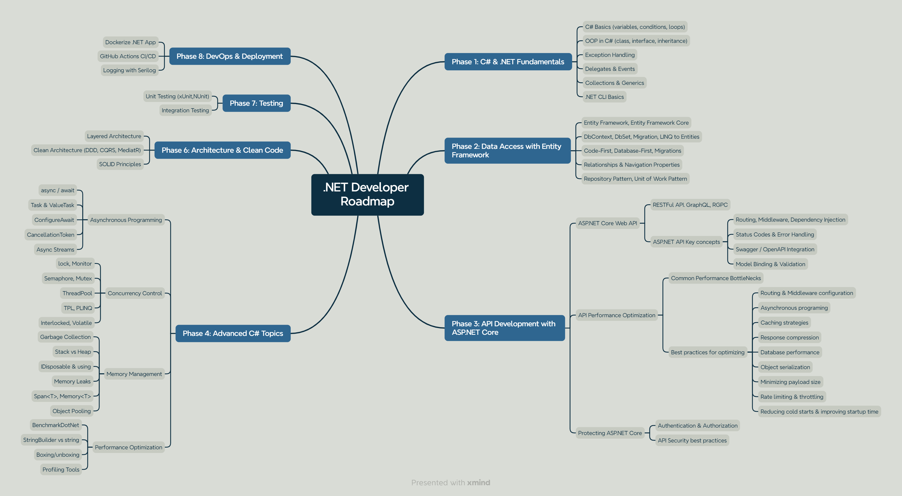

# .NET Developer Roadmap

A complete learning path to become a professional .NET Developer – from the fundamentals of C# to building enterprise-level microservices.

> 📌 Suitable for: Beginners to Intermediate Developers
> 
> 
> 🛠️ Focus Areas: C#, [ASP.NET](http://asp.net/) Core, EF Core, Microservices, Docker, Kubernetes
> 

---

---

## 🧪 Practice Project: Minimal E-Commerce API

To reinforce your learning throughout this roadmap, you’ll build a **Minimal E-Commerce API**, a hands-on project designed to help you apply each phase’s concepts in a real-world scenario.

- 🔧 Built with **.NET 8**, **Clean Architecture**, **CQRS**, and **DDD**
- 🧱 Structured as **microservices**: Product Service, Order Service, and Auth Service
- 🔐 Covers key skills including authentication, data access, performance optimization, and deployment
- 🧪 Includes unit tests, integration tests, CI/CD, and API performance best practices

You’ll progressively implement this project as you move through the roadmap phases. View the project [here](mini-projects\Minimal.ECommerce\README.md)

---

## 📂 Contents

- 📍 Phase 1: [C# & .NET Fundamentals](resources/phase-1/phase1.md)
- 🧱 Phase 2: [Data Access with Entity Framework](resources/phase-2/phase2.md)
- 🧰 Phase 3: API Development with ASP.NET Core
- 🧠 Phase 4: Advanced C# Topics
- 🧼 Phase 5: Architecture & Clean Code
- 🧪 Phase 6: Testing
- ⚙️ Phase 7: DevOps & Deployment

