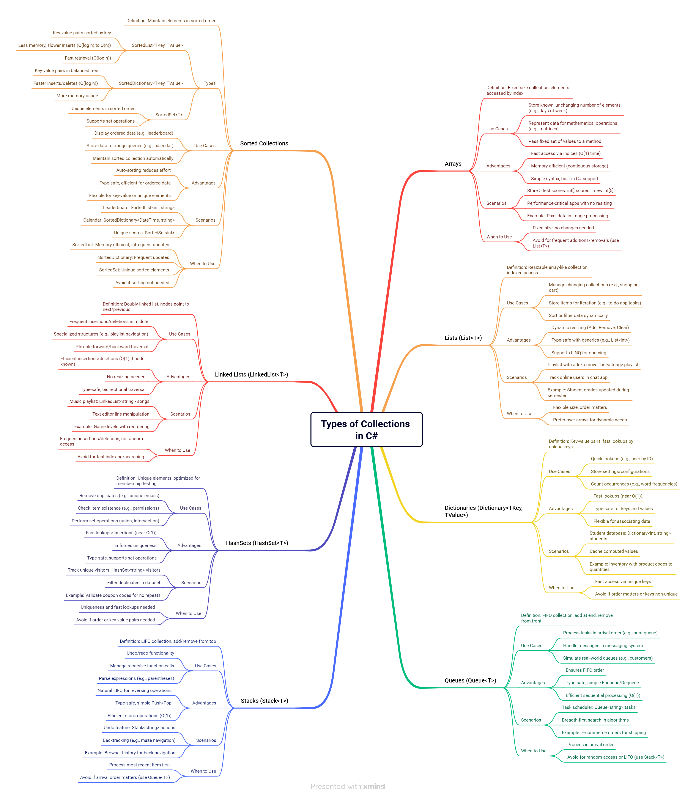

# Collections & Generics

## **What are Collections in C# and why do we use them?**

Imagine you have a bunch of items, like books, and you want to keep them organized. In programming, a **collection** is like a container that holds multiple items (objects) of the same or different types.

**Why do we use them?**

- **Organize Data:** Collections provide a structured way to store and manage groups of data.
- **Efficient Operations:** They offer built-in methods for common operations like adding, removing, searching, and sorting items.
- **Flexibility:** Collections can grow or shrink dynamically as needed, unlike fixed-size arrays.

## **Types of Collections in C#**

C# provides various collection types, each with its own characteristics and use cases. Here are some of the most common ones:

- **Array:**
    - Fixed-size collections that store elements of the same data type.
    - Fast for accessing elements by index.
    - **Example:**
    
    ```csharp
    int[] numbers = { 1, 2, 3, 4, 5 };
    string[] names = new string[3]; // Array of 3 strings
    names[0] = "Alice";
    ```
    
- **`Lists ( List<T> ):`**
    - Dynamically resizable collections that store elements of the same data type.
    - Provide methods for adding, removing, inserting, and searching elements.
    - **Example:**
    
    ```csharp
    List<string> fruits = new List<string>();
    fruits.Add("Apple");
    fruits.Add("Banana");
    fruits.Add("Orange");
    fruits.Remove("Banana");
    ```
    
- **`Dictionaries ( Dictionary<TKey, TValue> ):`**
    - Collections that store key-value pairs.
    - Keys must be unique, and values can be of any type.
    - Efficient for looking up values based on their keys.
    - **Example:**
    
    ```csharp
    Dictionary<string, int> ages = new Dictionary<string, int>();
    ages.Add("Alice", 30);
    ages.Add("Bob", 25);
    int aliceAge = ages["Alice"]; // Access value by key
    ```
    
- **`Queues ( Queue<T> ):`**
    - Collections that follow the "First-In, First-Out" (FIFO) principle.
    - Elements are added to the back (enqueue) and removed from the front (dequeue).
    - **Example:**
    
    ```csharp
    Queue<string> orders = new Queue<string>();
    orders.Enqueue("Order 1");
    orders.Enqueue("Order 2");
    string nextOrder = orders.Dequeue(); // "Order 1"
    ```
    
- **`Stacks ( Stack<T> ):`**
    - Collections that follow the "Last-In, First-Out" (LIFO) principle.
    - Elements are added to the top (push) and removed from the top (pop).
    - **Example:**
    
    ```csharp
    Stack<string> books = new Stack<string>();
    books.Push("Book A");
    books.Push("Book B");
    string topBook = books.Pop(); // "Book B"
    ```
    

## **What are Generics in C# and why are they important?**

**Generics** allow you to define classes, interfaces, and methods that can work with any data type without specifying the type at the time of declaration.  Instead, you use a placeholder (a type parameter) that is replaced with the actual type when the code is used.

**Why are they important?**

- **Code Reusability:** Write code once and use it with different data types. For example, a generic `List<T>` can store integers, strings, or any other type.
- **Type Safety:** Generics provide compile-time type checking, preventing you from accidentally adding the wrong type of object to a collection. This reduces the risk of runtime errors.
- **Performance:** Generics often provide better performance than non-generic collections because they avoid the need for boxing and unboxing (converting between value types and reference types).

## **How do you create and use Generic classes and Generic methods?**

**Generic Class Example:**

```csharp
public class MyGenericClass<T>
{
    private T myValue;

    public MyGenericClass(T value)
    {
        myValue = value;
    }

    public T GetValue()
    {
        return myValue;
    }
}

// Usage:
MyGenericClass<int> intObject = new MyGenericClass<int>(10);
int intValue = intObject.GetValue(); // 10

MyGenericClass<string> stringObject = new MyGenericClass<string>("Hello");
string stringValue = stringObject.GetValue(); // "Hello"
```

**Generic Method Example:**

```csharp
public static void PrintValue<T>(T value)
{
    Console.WriteLine("Value: " + value);
}

// Usage:
PrintValue<int>(100);     // Output: Value: 100
PrintValue<string>("World"); // Output: Value: World
PrintValue(true);        // Output: Value: True (Type inference)
```

## **Differences between Generic and Non-Generic Collections**

C# provides both generic and non-generic collections.

- **Generic Collections:**
    - Located in the `System.Collections.Generic` namespace.
    - Type-safe: They enforce the type of elements they can hold at compile time.
    - Examples: `List<T>`, `Dictionary<TKey, TValue>`, `Queue<T>`, `Stack<T>`.
    - Generally preferred due to better performance and type safety.
- **Non-Generic Collections:**
    - Located in the `System.Collections` namespace.
    - Not type-safe: They store elements as `object`, which requires casting when retrieving values.
    - Examples: `ArrayList`, `Hashtable`, `Queue`, `Stack`.
    - Less performant due to boxing and unboxing. Generally, you should use generic collections instead.

**Example:**

```csharp
// Non-generic ArrayList (less type-safe, slower)
System.Collections.ArrayList arrayList = new System.Collections.ArrayList();
arrayList.Add(10);
arrayList.Add("Hello");
int number = (int)arrayList[0]; // Requires casting, can cause errors

// Generic List<T> (type-safe, faster)
System.Collections.Generic.List<int> genericList = new System.Collections.Generic.List<int>();
genericList.Add(10);
// genericList.Add("Hello"); // Compile-time error!
int genericNumber = genericList[0]; // No casting needed

```

## **Best practices for using Collections and Generics in C#**

- **Choose the Right Collection:** Select the collection type that best suits your needs (e.g., `List<T>` for ordered lists, `Dictionary<TKey, TValue>` for key-value pairs).
- **Use Generics:** Prefer generic collections (like `List<T>`, `Dictionary<TKey, TValue>`) over non-generic ones (like `ArrayList`, `Hashtable`) for better type safety and performance.
- **Initialize Collections Properly:** Initialize collections with an appropriate initial capacity if you have an idea of how many elements they will hold to avoid unnecessary resizing.
- **Understand Collection Behavior:** Be aware of the performance characteristics of different collections (e.g., accessing an element by index in a `List<T>` is fast, while searching in a `List<T>` can be slower).
- **Use the Correct Methods:** Use the appropriate methods for adding, removing, and searching elements (e.g., `Add()`, `Remove()`, `Contains()`, `Find()`).
- **Consider Read-Only Collections:** If you need to prevent a collection from being modified after it's created, use read-only wrappers like `AsReadOnly()` or `ReadOnlyCollection<T>`.
- **Use LINQ:** Leverage LINQ (Language Integrated Query) to perform powerful queries and operations on collections in a concise and readable way.

## **Conclusion**

Collections and Generics are essential tools in C# development. Collections provide ways to store and manage groups of data, while Generics enable you to write reusable and type-safe code. By understanding the different types of collections and how to use generics effectively, you can write more efficient, organized, and maintainable C# applications. Keep practicing, and you'll master them in no time!

---

## Mindmaps



---

## **References**

- Microsoft Documentation on Collections: [https://learn.microsoft.com/en-us/dotnet/standard/collections/](https://learn.microsoft.com/en-us/dotnet/standard/collections/)
- Microsoft Documentation on Generics: [https://learn.microsoft.com/en-us/dotnet/csharp/programming-guide/generics/](https://learn.microsoft.com/en-us/dotnet/csharp/programming-guide/generics/)
- C# Programming Guide - System.Collections.Generic: [https://learn.microsoft.com/en-us/dotnet/api/system.collections.generic?view=net-7.0](https://learn.microsoft.com/en-us/dotnet/api/system.collections.generic?view=net-7.0)