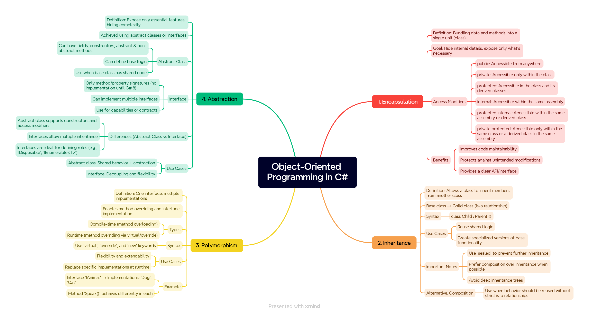

# OOP in C#

## What is OOP?

**Object-Oriented Programming (OOP)** is a programming paradigm that organizes software into **objects** – encapsulating both **data** and **behavior**.

---

## The 4 Main Principles of OOP

Principle | Simple Explanation | Implementation in C# | Notes for Developers |
--- | --- | --- | --- |
[Encapsulation](oop-in-csharp/abstraction.md) | Hiding internal details and exposing only what's necessary | Use `private`, `public`, `protected`, `internal` | Expose only what’s needed. Prefer **properties** over fields |
[Inheritance](oop-in-csharp/inheritance.md) | Allowing one class to inherit from another | `class A : B` | Avoid deep inheritance chains – they reduce maintainability |
[Polymorphism](oop-in-csharp/polymorphism.md) | Same action behaves differently depending on the object | Use `virtual`, `override`, `abstract`, `interface` | Useful for designing flexible, extensible systems |
[Abstraction](oop-in-csharp/abstraction.md) | Focusing on **what** something does, not **how** it does it | Use `abstract class` and `interface` | Clear contracts – separates interface from implementation |

---

## Mindmap: 4 Priciples of OOP

---

## References:

[OOP in C#](https://learn.microsoft.com/en-us/dotnet/csharp/fundamentals/object-oriented/)