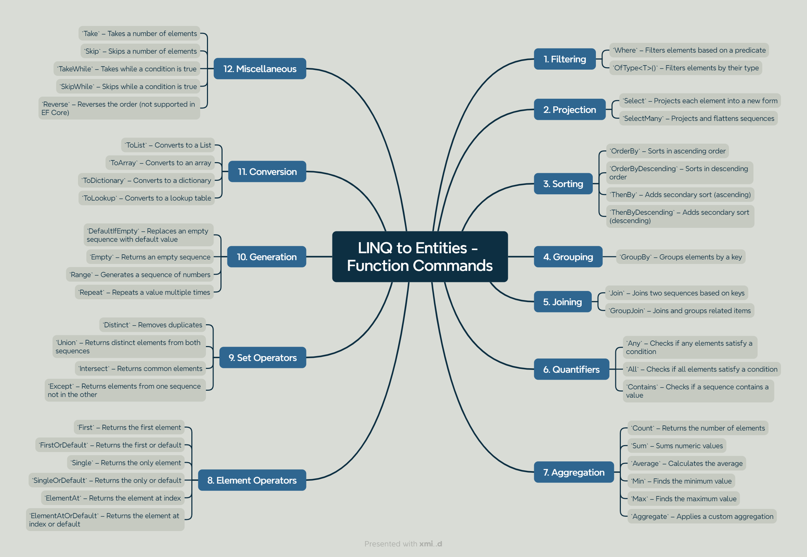

# Entity Framework Introduction

## Entity Framework vs. Entity Framework Core – Key Differences?

### Entity Framework (EF)

Entity Framework is the original ORM introduced by Microsoft for .NET Framework. It enables developers to work with relational databases using .NET objects, reducing the need for handwritten SQL.

- **Platform**: Tied to .NET Framework (Windows-only).
- **Features**: Mature, with extensive support for legacy systems, but heavier and less modular.
- **Use Case**: Best for maintaining older .NET Framework applications.

### Entity Framework Core (EF Core)

EF Core is a lightweight, cross-platform, and open-source rewrite of EF, designed for .NET Core and modern .NET applications.

- **Platform**: Cross-platform, runs on .NET Core, .NET 5+ (including Windows, macOS, Linux).
- **Performance**: Faster and more modular than EF.
- **Features**: Supports modern database features, NoSQL databases, and improved querying capabilities.
- **Use Case**: Preferred for new .NET applications, cloud-native development, and cross-platform projects.

### Key Differences

- **Architecture**: EF Core is more modular, allowing selective inclusion of features to reduce overhead.
- **Cross-Platform**: EF Core supports non-Windows environments, unlike EF.
- **Database Support**: EF Core supports NoSQL databases (e.g., Cosmos DB) and has broader provider compatibility.
- **Features Missing in EF Core**: Some EF features, like lazy loading proxies and EDMX-based modeling, are simplified or absent in EF Core.
- **Performance**: EF Core is optimized for modern workloads, with better query translation and reduced memory footprint.

**Best Practice**: Use EF Core for new projects unless maintaining legacy .NET Framework applications.

---

## How EF Core Works

EF Core abstracts database operations through key components:

### `DbContext`

- The `DbContext` class represents a session with the database. It acts as a bridge between your domain objects and the database.
- It's responsible for:
    - Tracking changes to entities.
    - Querying data from the database.
    - Saving data to the database.
    - Configuring database connections and models.

```csharp
public class BloggingContext : DbContext
{
    public DbSet<Blog> Blogs { get; set; }
    public DbSet<Post> Posts { get; set; }

    protected override void OnConfiguring(DbContextOptionsBuilder optionsBuilder)
    {
        optionsBuilder.UseSqlServer("YourConnectionString");
    }

    protected override void OnModelCreating(ModelBuilder modelBuilder)
    {
        modelBuilder.Entity<Blog>()
            .Property(b => b.Url)
            .IsRequired();
    }
}
```

**Best Practice:** Keep your `DbContext` instances short-lived (e.g., within a request scope in web applications) to manage resources effectively and avoid potential concurrency issues.

### `DbSet<TEntity>`

- A `DbSet<TEntity>` represents a collection of all entities of a given type in the database.
- It provides methods for querying, adding, updating, and deleting entities.
- Think of `DbSet<Blog>` as the in-memory representation of the `Blogs` table.

```csharp
using (var context = new BloggingContext())
{
    // Querying
    var blogs = context.Blogs.ToList();

    // Adding a new blog
    var newBlog = new Blog { Url = "https://example.com/blog" };
    context.Blogs.Add(newBlog);
    context.SaveChanges();
}
```

### Migrations

- Migrations are a way to manage changes to your database schema over time as your model evolves.
- EF Core keeps track of the changes you make to your entity classes and generates corresponding database schema updates.
- Commands in the Package Manager Console (PMC) or .NET CLI are used to create and apply migrations:
    - `Add-Migration InitialCreate` (PMC) or `dotnet ef migrations add InitialCreate` (.NET CLI) - Creates a new migration.
    - `Update-Database` (PMC) or `dotnet ef database update` (.NET CLI) - Applies pending migrations to the database.
    - `Script-Migration` (PMC/CLI) - Generates a SQL script from migrations.

**Best Practice:** Use migrations to version-control your database schema and ensure consistent database updates across different environments.


### LINQ to Entities

- LINQ (Language Integrated Query) allows you to write queries against your data using a C# syntax.
- EF Core translates these LINQ queries into efficient SQL queries that are executed on the database.

```csharp
using (var context = new BloggingContext())
{
    // LINQ query to find blogs with URLs containing "example"
    var filteredBlogs = context.Blogs
        .Where(b => b.Url.Contains("example"))
        .OrderByDescending(b => b.BlogId)
        .ToList();
}
```

**Insight:** EF Core performs query optimization behind the scenes, but understanding how your LINQ translates to SQL is crucial for writing performant queries. Tools like SQL Server Profiler (for SQL Server) or other database-specific tools can help you see the generated SQL.



---

## **Configuration:**

Database connection is typically configured in the `OnConfiguring` method of your `DbContext` or through dependency injection in ASP.NET Core applications.

### **Using `OnConfiguring`:**

```csharp
protected override void OnConfiguring(DbContextOptionsBuilder optionsBuilder)
{
    optionsBuilder.UseSqlServer("YourConnectionString");
}
```

### **Using Dependency Injection (ASP.NET Core):**

In your `Startup.cs` or `Program.cs`:

```csharp
public void ConfigureServices(IServiceCollection services)
{
    services.AddDbContext<BloggingContext>(options =>
        options.UseSqlServer(Configuration.GetConnectionString("DefaultConnection")));
}
```

**Best Practice:** Store your connection strings securely using configuration files (e.g., `appsettings.json`) and environment variables, especially in production environments.